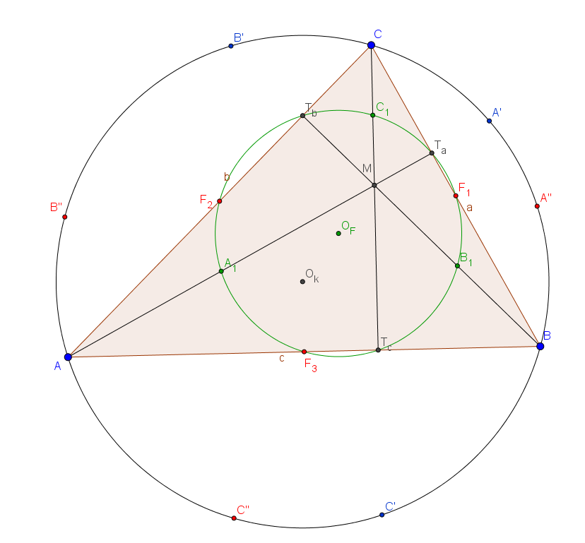

# Feuerbach-kör

Egy háromszög magasságok talppontjai, oldalak felezőpontjai és a magasságpont és csúcsok felezőpontjai egy körön vannak.

[Geogebra fájl, készítette Grallert Krisztina](ggb/feuerbach.ggb) 
