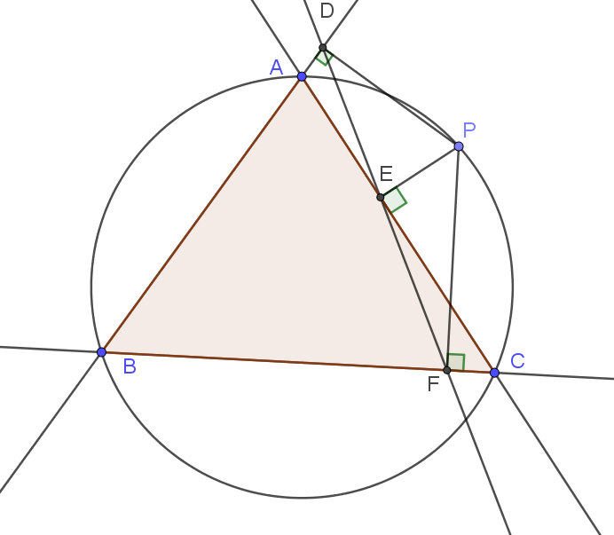

# Simson-egyenes

Adott $ABC_\Delta$ és $k$ körülírható köre. A $k$ körön kiválasztunk egy $P$ pontot. A $D$, $E$, $F$ pontok a $P$ merőleges vetületei rendre az $AB$, $AC$, $BC$ oldalegyenesekre.

Állítás: $D$, $E$ és $F$ egy egyenesre illeszkednek.

[Geogebra fájl](ggb/simson-egyenes.ggb)
