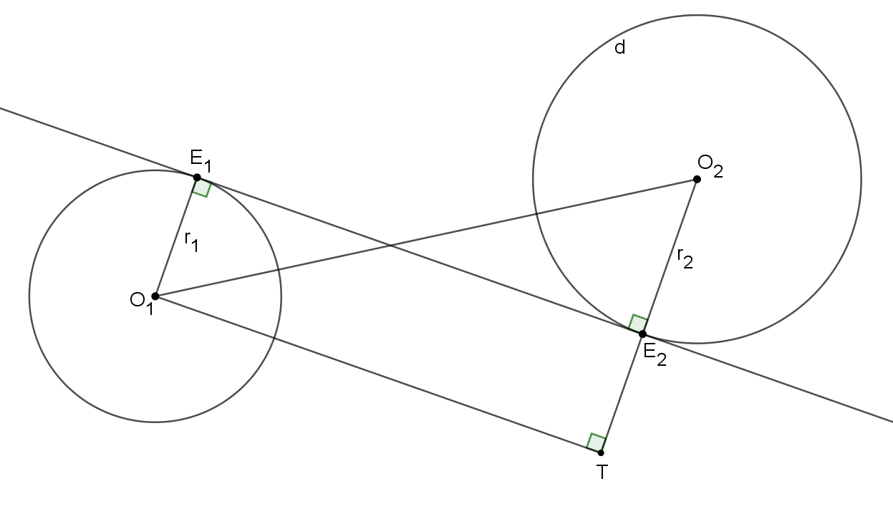
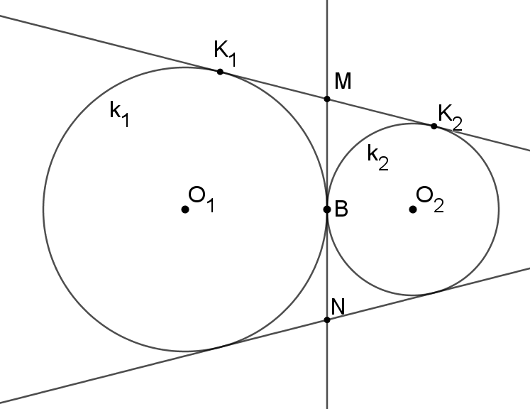

# Belső közös érintők

Definíció: olyan egyenes, mely mindkét körnek érintője és metszi a két kör középpontját összekötő szakasz.

## Szakasz hossza

Feltesszük, hogy a két kör nem metszi egymást.

${O_1TO_2}_{\Delta}$-ben Pitagorasz tétel:

$$ {O_1T}^2 + {TO_2}^2 = {O_1O_2}^2 $$

Mivel $O_1TE_2E_1$ téglalap $\Rightarrow O_1T=E_1E_2$, így:

$$ {E_1E_2}^2 + {TO_2}^2 = {O_1O_2}^2 $$

$$ {E_1E_2}^2 + \left(r_1 + r_2\right)^2 = {O_1O_2}^2 $$

$$ E_1E_2 = \sqrt{{O_1O_2}^2 - \left(r_1 + r_2\right)^2} $$

## Szerkesztése

1. A ${O_1TO_2}_{\Delta}$-t megszerkesztjük
    - Átfogója $O_1O_2$
    - $T$-től tudjuk
        - derékszögű csúcs ($O_1O_2$ Thálesz-körén rajta van)
        - $O_2T = r_1 + r_2$
2. $O_2T$ szakasz $E_2$-ben metszi a kört
3. Merőlegest szerkesztünk az $O_2E_2$ sugárra

## Érintő körök esetén

$E_1E_2$, $F_1F_2$ [külső közös érintő](külső-közös-érintők.md).

Az $MK_1 = MB$, mert $M$ a $k_1$ kör érintőinek metszésopontja, hasonlóan $MK_2 = MB$.

Mivel az ábra tengelyszimmetrikus, így $MB = BN$.

Tehát $MN = MB + BN = 2MB = MK_1+MK_2 = K_1K_2 = 2\sqrt{r_1r_2}$ (lásd [érintő körök külső érintőinek hossza](külső-közös-érintők.md#érintő-körök-esetén))