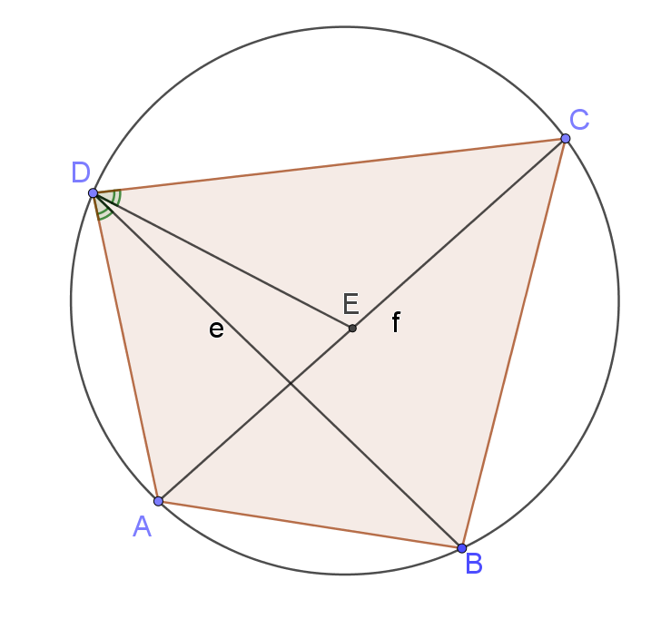

# Húrnégyszögek

Egy négyszög húrnégyszög, ha van köréírható köre.

 - Minden téglalap (és négyzet) húrnégyszög
 - Rombusz, paralelogramma húrnégyszög, ha téglalap.
 - Trapéz húrnégyszög, ha két párhuzamos oldalára igaz, hogy a két rajta fekvő szög egyenlő.
 - Deltoid húrnégyszög, ha két szemközti szöge 90°.

## Ptolemaiosz tétel

Adott húrnégyszög rendre $a$, $b$, $c$, $d$ oldalakkal, $e$, $f$ átlókkal, akkor $ef = ac + bd$.

### Bizonyítás

Vegyünk fel $E$ pontot az $AC$ egyenesen, úgy hogy $ADB\angle=CDE\angle$.

$DCA\angle = DBA\angle$, mert mindekettő a ($C$-n nem átmenő) $AD$ ívhez tartozik.

$ABD_\Delta \sim ECD_\Delta$, mert (SSS-eset)

- $ADB\angle=EDC\angle$
- $ABD\angle=ECD\angle$

$\Rightarrow \frac{CE}{c}=\frac{a}{e} \Rightarrow e \cdot CE = ac$ (I.)

$DAC\angle = DBC\angle$, mert mindekettő a ($A$-n nem átmenő) $CD$ ívhez tartozik.

$AED_\Delta \sim BCD_\Delta$, mert (SSS-eset)

- $ADE\angle = ADB\angle + BDE\angle = CDE\angle + BDE\angle = BDC\angle$
- $DAE\angle = DBC\angle$

$\Rightarrow \frac{AE}{d} = \frac{d}{e} \Rightarrow e \cdot AE = bd$ (II.)

(I.) + (II.): $e\left(AE+CE\right)=ac+bd \Rightarrow ef = ac+bd$

### Megfordítása

Megfordítása igaz.
