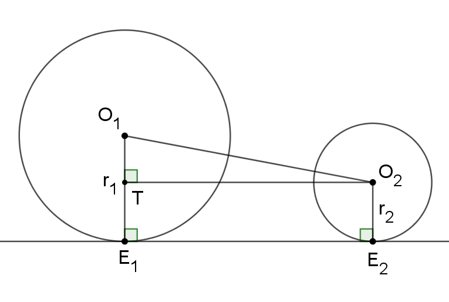
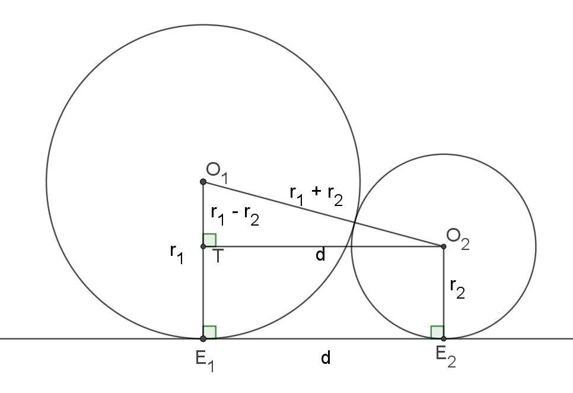

# Külső közös érintők

Definíció: olyan egyenes, mely mindkét körnek érintője és *nem* metszi a két kör középpontját összekötő szakasz.

## Szakasz hossza

Feltételezzük, hogy $r_1>r_2$.

${O_1TO_2}_{\Delta}$-ben Pitagorasz-tétel:

$$ {TO_2}^2 + {TO_1}^2 = {O_1O_2}^2 $$

$$ {TO_2}^2 + \left(r_1 - r_2\right)^2 = {O_1O_2}^2 $$

Mivel $E_1E_2O_2T$ téglalap $\Rightarrow TO_2 = E_1E_2$, így

$$ {E_1E_2}^2 + \left(r_1 - r_2\right)^2 = {O_1O_2}^2 $$

$$ E_1E_2 = \sqrt{{O_1O_2}^2 - \left(r_1 - r_2\right)^2} $$

### Érintő körök esetén

${O_1TO_2}_{\Delta}$-ben Pitagorasz-tétel:

$$ d^2 + \left(r_2 - r_1\right)^2 = \left(r_1 + r_2\right)^2 $$

$$ d^2 + r_2^2 - 2r_1r_2 + r_1^2 = r_1^2 + 2r_1r_2 + r_2^2 $$

$$ d^2 = 4r_1r_2 $$

## Szerkesztése

1. A ${O_1TO_2}_{\Delta}$-t megszerkesztjük
    - Átfogója $O_1O_2$
    - $T$-től tudjuk
        - derékszögű csúcs ($O_1O_2$ Thálesz-körén rajta van)
        - $O_1T = r_1 - r_2$
2. $O_1T$-t meghosszabbítjuk, $E_1$-ben metszi a kört
3. Merőlegest szerkesztünk a $O_1E_1$ sugárra
