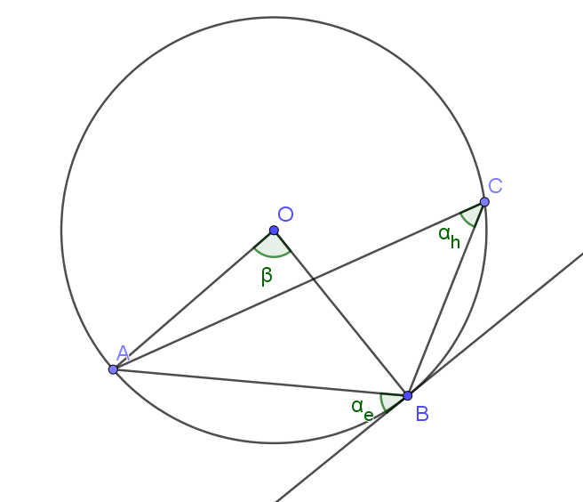

# Kerületi és középponti szögek

## Definíciók

Középponti szög (ábrán $\beta$): szög melynek csúcsa a kör középpontja

Kerületi szög: konvex szög, amelynek

- csúcsa a kör kerületén helyezkedik el
- egyik szára egy húr
- másik szára
    - vagy egy húr (ábrán $\alpha_h$)
    - vagy egy érintő (ábrán $\alpha_e$)

## Összefüggések

$\beta = 2\alpha$, ahol

- adott $k$ kör
- adott $i$ ív $k$ körben
- $\beta$
    - $i$ ívhez tartozik
    - $k$ körben középponti szög
- $\alpha$
    - $i$ ívhez tartozik
    - $k$ körben kerületi szög
