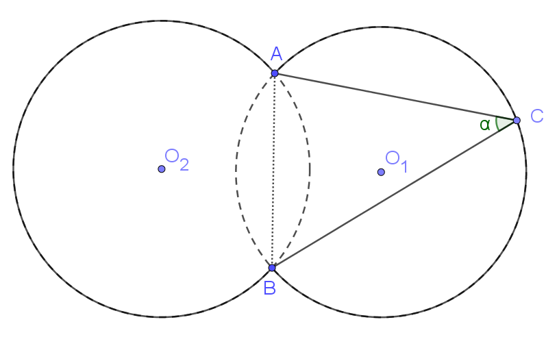

# Kerületi és középponti szögek

## Definíciók

Középponti szög (ábrán $\beta$): szög melynek csúcsa a kör középpontja

Kerületi szög: konvex szög, amelynek

- csúcsa a kör kerületén helyezkedik el
- egyik szára egy húr
- másik szára
    - vagy egy húr (ábrán $\alpha_h$)
    - vagy egy érintő (ábrán $\alpha_e$)

## Összefüggések

$\beta = 2\alpha$, ahol

- adott $k$ kör
- adott $i$ ív $k$ körben
- $\beta$
    - $i$ ívhez tartozik
    - $k$ körben középponti szög
- $\alpha$
    - $i$ ívhez tartozik
    - $k$ körben kerületi szög

## Látószögkörív

Feladat: adott $AB$ szakasz és $\alpha$ szög. Szerkesszük meg azon $P$ pontok halmazát, amelyre $APB\angle=\alpha$. (Ezen pontok halmazát hívjuk látószögkörívnek.)

Ezen pontok halmaza két köríven helyezkedik el, ezeknek középpontja $O_1$, $O_2$.

Az $ACB\angle$ az $O_1$ középpontú körnek szaggatottal jelölt $AB$ ívéhez tartózó kerületi szöge, míg $AO_1B\angle$ középponti szöge, így $AO_1B\angle = 2ACB\angle = 2\alpha$.

$O_1A=O_1B\Rightarrow O_1AB_\Delta$ egyenlőszárú

 - $\Rightarrow O_1AB\angle = O_1BA\angle = \frac{180°-AO_1B\angle}{2} = 90°-\alpha$.
 - $\Rightarrow O_1$ rajta van $AB$ felezőmerőlegesén.

Ezek hasonlóan igazak $O_2$-re is.

### Szerkesztés menete

1. Megszerkesztjük $O_1AB_\Delta$-t.
    - adott $AB$
    - $O_1AB\angle=O_1BA\angle=90°-\alpha$
    - ($O_1$ rajta van $AB$ felezőmerőlegesén)
2. Hasonlóan megszerkesztjük $O_2AB_\Delta$-t vagy $O_1$-et tengelyesen tükrözzük $AB$-re.
3. $O_1$-ből, $O_2$-ből körívet rajzolunk $O_1A$ sugárral.