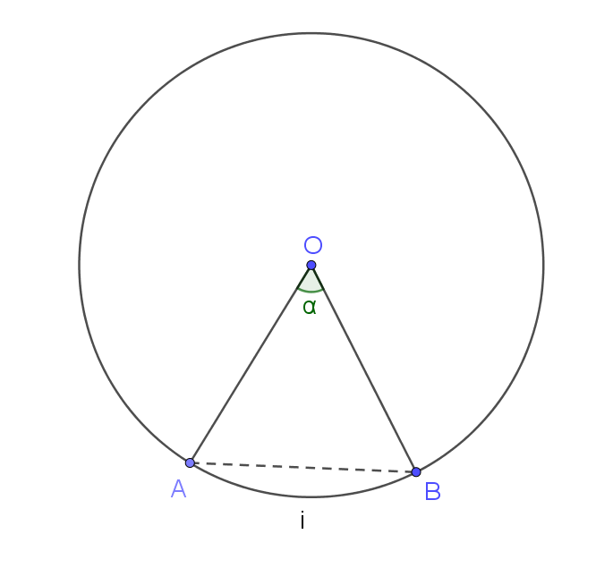

# Szögek, ívek, szeletek

## Definíciók

Középponti szög (ábrán $\alpha$): szög melynek csúcsa a kör középpontja

Ív (ábrán $i$): két pont által meghatározott kör egybefüggő részhalmaza

Cikk: a középponti szög és ív által határolt síkidom

Szelet: az ív és egy húr (ábrán $AB$) által határolt síkidom

Radián (ívmérték): egyenlő az egységkör egységívéhez tartozó szöggel

- $\pi \text{ rad} = 180°$ 

## Összefüggések

$$ i = \frac{\alpha}{360°} \cdot 2r\pi = \overset{\frown}{\alpha}r $$

$$ T_{cikk} = \frac{\alpha}{360°} \cdot r^2\pi = \frac{\overset{\frown}{\alpha}r^2}{2} $$

$$ T_{OAB_\Delta} = \frac{r^2\sin \overset{\frown}{\alpha}}{2} $$

$$ T_{szelet} = T_{cikk} - T_{OAB_\Delta} $$
